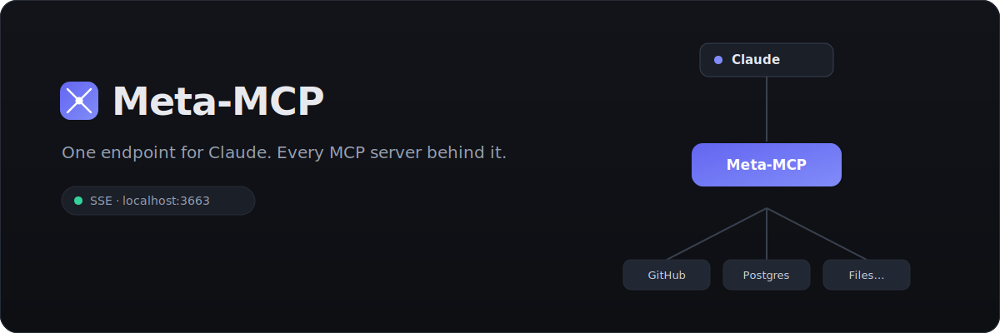

<p align="center">
  
</p>

<p align="center">
  
  
  
  
  
</p>

# Meta-MCP

A small **Tauri 2** desktop app that acts as a central **MCP proxy**. It aggregates
many MCP servers behind a single local endpoint and exposes only the tools of the
**currently active** servers to Claude — so Claude needs exactly **one** entry, and
you manage everything else from a UI.

Instead of editing Claude's config every time you add, remove, or toggle a server,
you point Claude at Meta-MCP once and flip switches in the app.

## Why

```
                 ┌──────────────────────────┐
   Claude  ──────▶        Meta-MCP           ──────▶  GitHub MCP   (stdio)
 (one entry)     │  aggregate · prefix ·     ──────▶  Postgres MCP (stdio)
                 │  route · hot-reload       ──────▶  Remote Docs  (SSE)
                 └──────────────────────────┘         …toggle live
```

- **One endpoint, many servers.** Claude talks to `http://localhost:3663`. Meta-MCP
  merges every active server's `tools/list` and routes each `tools/call` to the right
  backend.
- **Toggle without restarts.** Activate/deactivate servers or switch **profiles**;
  the visible tool set updates live.
- **No more config surgery.** Add servers in the UI or let them register themselves.

## Features

- **Two client transports** on port `3663`: legacy **HTTP+SSE** (`GET /sse` +
  `POST /message`) and modern **Streamable HTTP** (`POST /mcp`).
- **Three backend transports**: spawns `stdio` MCP servers as child processes and
  connects to remote servers over **Streamable HTTP** or legacy **SSE**.
- **Authenticated remote servers**: send custom headers per server (e.g. a
  `Authorization: Bearer <token>` you paste from a dashboard) **and** a full
  interactive **OAuth 2.1** login (discovery, dynamic client registration, PKCE,
  browser sign-in, token refresh) for servers that require an account — a
  **Login** button appears when a server returns `401`.
- **Tool aggregation** with readable name prefixing — `{server-slug}__{tool}`
  (e.g. `github__create_issue`). Collisions get a numeric suffix; the router splits on
  the first `__` only and strips the prefix before forwarding.
- **Profiles** — save a set of active servers and switch between them. A profile
  overrides the per-server toggles; clearing it restores them.
- **One-click Claude registration** — register Meta-MCP into **Claude Code** and
  **Claude Desktop** straight from the app (see below).
- **Self-registration for other apps** — a localhost `POST /register` endpoint **and**
  a live `config.json` watcher, so your own tools can add themselves to Meta-MCP
  instead of cluttering Claude's config.
- **Import** from an existing `claude_desktop_config.json` (with preview; existing
  names skipped).
- **Live status** — header status dot (running / starting / port-in-use) and per-server
  connection state, driven by a `proxy-status-changed` event.

## Install

**Download** the latest `.dmg` from [Releases](../../releases). It's an unsigned
open-source build, so on first launch macOS Gatekeeper needs one nudge:

```bash
# after copying Meta-MCP.app to /Applications (or Desktop)
xattr -dr com.apple.quarantine /Applications/Meta-MCP.app
```

…or right-click the app → **Open** → **Open**.

**Or build it yourself** (see [Development](#development)).

## Connect to Claude

Start Meta-MCP, then open the **Claude-Anbindung** section and flip the toggle for your
target — Meta-MCP writes the entry for you (and removes it when you toggle off). Both
edits are non-destructive: only the `meta-mcp` key changes, everything else in your
config is preserved.

<details>
<summary>What the toggles do under the hood</summary>

**Claude Code** supports remote servers natively, so the entry goes into
`~/.claude.json` (user scope):

```jsonc
// ~/.claude.json → "mcpServers"
"meta-mcp": { "type": "http", "url": "http://localhost:3663/mcp" }
```

Equivalent manual command:

```bash
claude mcp add --transport http meta-mcp http://localhost:3663/mcp --scope user
```

**Claude Desktop's** `claude_desktop_config.json` only supports **stdio** servers — it
**cannot** take a remote `url` directly. Meta-MCP therefore registers its own binary in
a built-in **stdio-bridge** mode, which forwards stdio ↔ the running proxy (and launches
the app if it isn't running yet):

```jsonc
// claude_desktop_config.json → "mcpServers"
"meta-mcp": { "command": "/Applications/Meta-MCP.app/Contents/MacOS/meta-mcp", "args": ["--stdio"] }
```

(Alternatively, add it via Claude Desktop → **Settings → Connectors**.)
</details>

## Let other apps register with Meta-MCP

The whole point is that **Claude sees one entry**. So instead of having each of your
tools register itself directly into Claude, point them at Meta-MCP — and they appear
behind it automatically.

**Option A — HTTP (clean contract):**

```bash
curl -X POST http://localhost:3663/register -H 'Content-Type: application/json' -d '{
  "name": "My Tool",
  "transport": "stdio",
  "command": "npx",
  "args": ["-y", "@me/my-mcp-server"]
}'
```

**Option B — write the config file:** append your server to Meta-MCP's `config.json`
(below). Meta-MCP watches the file and hot-reloads — no restart needed.

Both make the server's tools live immediately.

## Data

Single JSON file in the app data directory:

- macOS: `~/Library/Application Support/com.metamcp.desktop/config.json`

## Architecture

```
src-tauri/src/
├── main.rs                 # entry → GUI, or stdio bridge when run with --stdio
├── lib.rs                  # Tauri setup: state, server bind, status, config watcher
├── commands.rs             # Tauri IPC commands
├── claude.rs               # self-registration into Claude Code / Desktop (+ test)
├── stdio_bridge.rs         # `meta-mcp --stdio` → forwards stdio ↔ the proxy
├── config/                 # config.json load/save + data types
└── proxy/
    ├── mod.rs              # ProxyState: active-set, reconcile, cache, register, reload
    ├── server.rs           # axum: SSE + Streamable HTTP + /register, JSON-RPC core
    ├── aggregator.rs       # prefixed tool list + slug→id map (cached)
    ├── router.rs           # tools/call → correct backend (strip prefix)
    ├── backend.rs          # Backend enum over the three transports
    ├── child.rs            # stdio child-process MCP client
    ├── sse_client.rs       # remote SSE MCP client
    └── http_client.rs      # remote Streamable HTTP MCP client

src/                        # Svelte 5 + Tailwind v4 + Material Symbols
├── App.svelte              # orchestrator
└── lib/                    # ClaudeConnect, ServerList, ToolList, ProfileBar, modal, Icon
```

## Development

Requires Rust (stable), Node 20+, and pnpm.

```bash
pnpm install
pnpm tauri dev      # run with hot reload
pnpm tauri build    # build .app + .dmg
```

## Scope (intentionally not built)

No tool editing, no auth on the meta endpoint, no cloud sync, no auto-update, no MCP
resources/prompts (tools only), no tool logging.

## License

[MIT](LICENSE) © Rene Jesser
